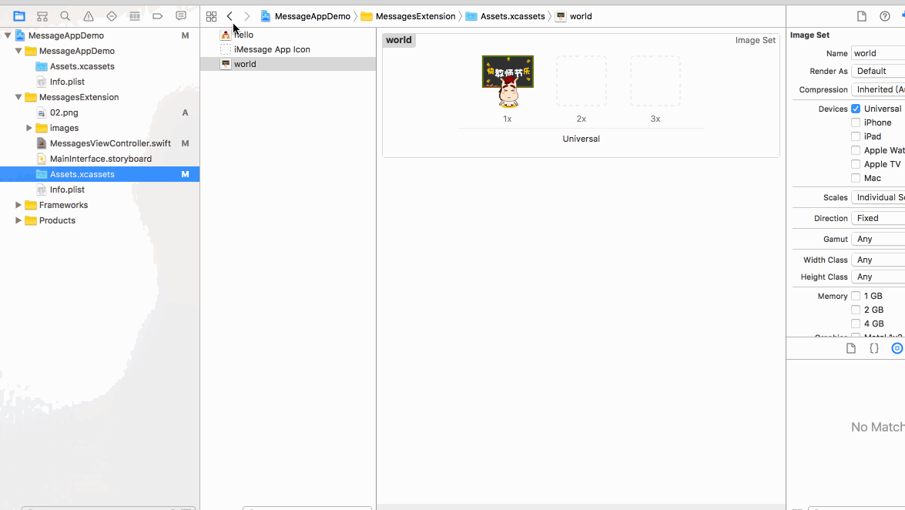
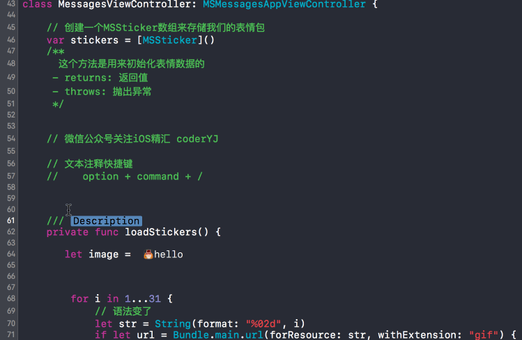

# iMessage-application
Xcode8自带图片预览

文本注释快捷键 option + command + /

iMessageApplication

微信公众号关注 iOS精汇 (微信号coderYJ)
[微博coderYJ](http://weibo.com/u/5348162268)
[简书coderYJ](http://www.jianshu.com/users/ce8eba0dbfb6/latest_articles)

